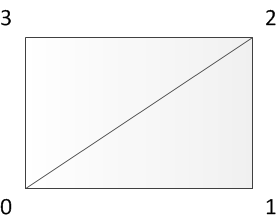
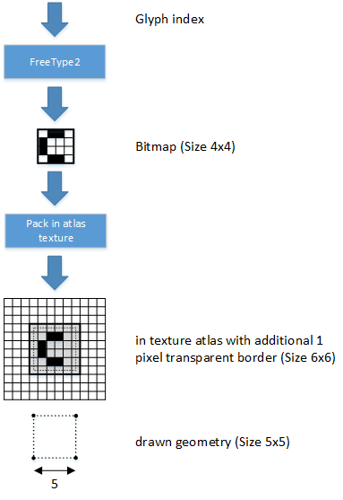
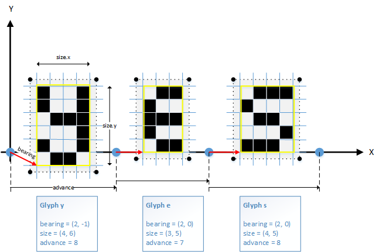

..
    -------------------------------------------------------------------------
    Copyright (C) 2023 BMW AG
    -------------------------------------------------------------------------
    This Source Code Form is subject to the terms of the Mozilla Public
    License, v. 2.0. If a copy of the MPL was not distributed with this
    file, You can obtain one at https://mozilla.org/MPL/2.0/.
    -------------------------------------------------------------------------

.. default-domain:: cpp
.. highlight:: cpp

=========================
Ramses Core overview
=========================

This page provides an overview of the ``Ramses`` C++ API, primary object types, structure and interaction.

.. note::

    Prefer learning by example? Jump straight to the :ref:`examples <List of all examples>`!
    Looking for a specific class or method? Check the :ref:`class index <Class Index>`

``RAMSES`` consists of three logical components:

* :ref:`client <The Client component>` (creates and publishes 3D content)
* :ref:`renderer <The Renderer component>` (consumes and displays)
* :ref:`daemon <The Daemon component>` (global address broker, exchanges connection info between clients and renderers in case the underlying communication is TCP)

These components can be deployed as separate applications and communicate over network, or can be all used in a local rendering
setup (within a monolithic application) - or in various hybrid combinations.

------------------------
The Client component
------------------------

.. TODO: This section is the most important part of ramses, but it skips all introduction and directly talks about API scopes...

Clients create scenes and manage their content, but cannot decide if and where a scene is shown (similar to a video stream which provides the video, but anyone can subscribe to it).
The following subsections provide details on the various aspects of the client API.

^^^^^^^^^^^^^^^^^^^^^^
Object scopes
^^^^^^^^^^^^^^^^^^^^^^

Objects of the RAMSES Client API live in different scopes, which determine

* who creates the object
* where this objects can be used
* who destroys the object (and when)

**Scope: :class:`ramses::RamsesClient` Instance**

* Objects are created and destroyed with the :class:`ramses::RamsesClient` object
* Examples for client objects: Scene, Client resources (immutable Textures, Vertex arrays, Effects...)
* On destruction of :class:`ramses::RamsesClient`, objects of this :class:`ramses::RamsesClient` instance will be deleted automatically
* To destroy objects created by :class:`ramses::RamsesClient`, one must explicitly call :func:`ramses::RamsesClient::destroy`
* Object of this scope can be used for all operations in this :class:`ramses::RamsesClient` instance.

**Scope: :class:`ramses::Scene` Instance**

* Objects are created and destroyed with the Scene object
* Examples for scene objects: :class:`ramses::Node`, :class:`ramses::MeshNode`, :class:`ramses::Camera`, :class:`ramses::Appearance`, ...
* On destruction of Scene, objects in this Scene instance will be deleted automatically
* To destroy objects created by Scene, one must explicitly call :func:`ramses::Scene::destroy`
* Objects of this scene instance can be used only with objects of the same scene instance
* Mixing up objects of different scene instances will result in error status or undefined behaviour (e.g. setting a parent-child relationship between nodes of different scenes; see :ref:`Validation`)

^^^^^^^^^^^^^^^^^^^^^^
API Object lifecycle
^^^^^^^^^^^^^^^^^^^^^^

Object lifecycle is an important topic in any C++ framework. In the case of ``Ramses``,
creation and destruction is strict, straightforward and simple,
but leaves the responsibility of object deletion in some cases to the user.

As described in the Scopes chapter, the ownership of objects is defined by their scope.
A :class:`ramses::MeshNode` is owned by a :class:`ramses::Scene`, which is owned by a :class:`ramses::RamsesClient`. If a RamsesClient
is destroyed, all of its scenes will be destroyed automatically, which in turn will
destroy the MeshNodes in those scenes and so on. This implicit destruction done by
RAMSES is limited to this case only, ie. when the 'owner' is destroyed then all the
objects created within this owner are destroyed and any pointers to those become invalid.

There is no reference counting of any sort therefore RAMSES will not automatically
destroy an object if it is not used by any other object and therefore user is responsible
for destroying unused content to free up resources. Creation and destruction of
objects can cause performance hit on both client and renderer so it is recommended to consider
some caching strategy on the application side.

^^^^^^^^^^^^^^^^^^^^^^
Resources
^^^^^^^^^^^^^^^^^^^^^^

There are 3 main types of resources in RAMSES

.. TODO add class links here

* **Immutable client resources** (texture, index/vertex buffer, effect)
* **Scene resources** (render buffer/target, stream texture, blit pass)
* **Dynamic resources** (data buffer, texture buffer)

These resource types differ by how are they created, owned and used for rendering a scene.
Here are some basic rules for when to use which type:

A typical use case for an **immutable client resource** is any resource that is created once
and does not need to be changed for a reasonably long period of time. A client resource
can be used by multiple scenes as it is owned by a RAMSES client instance and is typically
transferred asynchronously (see below). Client resources are designed to efficiently handle
large data and thus are best fit for static textures.

A **scene resource** represents some kind of GPU buffer (render buffer/target, stream texture)
or a rendering construct (blit pass). A scene resource has no initial user provided data
and its usage is clearly defined by the concrete type. Scene resources are created and owned
by a scene and can be used only within that scene, not across scenes as opposed to client resources.

The content of a **dynamic resource** is set by user and can be modified directly at any
time during its life cycle via RAMSES API. Even though the concrete types overlap with some of
the concrete types of client resource (index/vertex buffer, texture), the way dynamic resources
are handled in RAMSES is in fact closer to scene resources. Similar to a scene resource a dynamic
resource is created
and owned by a scene and can be used only within that scene. A typical use case is a resource that
frequently changes (even if only partially). Dynamic resources should be kept small as they
are processed synchronously together with other scene state changes.

""""""""""""""""""""""""""""""""""""""""""""""""
Asynchronous processing of client resources
""""""""""""""""""""""""""""""""""""""""""""""""

One important aspect of RAMSES, which is different from most other scene graph implementations, is the fact
that immutable client resources (Textures, Effects, Vertex arrays etc.) are
distributed asynchronously. This means that it might happen that a scene arrived on the renderer,
but some of its resources are still on the way and it will take more time
until all the resources are uploaded and ready for rendering. This is true also if the renderer<->client communication is
in the same process. Resources are usually big and
would block the entire rendering chain if they were transported/uploaded synchronously to the
rest of the scene objects.

The renderer always waits with the next content change (scene flush) until it has all the resources needed
for the new scene content state. Note that this does not affect framerate
on renderer side, the renderer will simply keep rendering the old state of the scene until
it receives all the resources required for the new state. But it can delay the changes
made in that flush as they are 'blocked' until all the resources are resolved.

^^^^^^^^^^^^^^^^^^^^^^
Return status
^^^^^^^^^^^^^^^^^^^^^^

The RAMSES API is designed to check most errors on usage - for example trying to create :class:`ramses::TextureSampler` using a write-only
:class:`ramses::RenderBuffer`
will result in error. The error message will appear in log and/or can be retrieved by using :func:`ramses::StatusObject::getStatusMessage` and passing
the status code returned from the API call.

It is highly recommended to check the status of every RAMSES API call, at least in debug configuration.
See :ref:`Validation` to find out other ways of checking the state of RAMSES objects.

^^^^^^^^^^^^^^^^^^^^^^
Validation
^^^^^^^^^^^^^^^^^^^^^^

Some of the content issues are too expensive to be handled by the normal
:ref:`return code <Return status>` of the Ramses API. Examples of such cases include:

* invalid states are very expensive to check, or...
* valid states which probably do not produce the desired result
* are wasting system resources: eg. having an empty :class:`ramses::RenderPass` which is being cleared every frame

.. TODO the statement below is not quite correct. It's possible to check for cyclic dependencies, and Logic actually does just that

Another good example of an invalid state is a cyclic dependency on the node graph. If one creates three nodes A, B, C
and sets following parent-child dependencies:

* A->B
* B->C
* C->A

This is not an error that RAMSES checks, because it is very expensive to traverse the whole scene graph every time a new node is
added as a child of another node.

For development purposes, there are other means to check the state of the scene(s) and understand why the resulting image is not
as expected.

""""""""""""""""""""""""""
Client side validation
""""""""""""""""""""""""""

The state of a RAMSES object can be checked at any time by calling :func:`ramses::StatusObject::validate` method on its instance.
The :func:`ramses::StatusObject::validate` method will do two things:

* return an overall result status of the object (valid or invalid)
* produce a human-readable report of the state of that object

The report can be obtained by calling :func:`ramses::StatusObject::getValidationReport`
immediately after calling :func:`ramses::StatusObject::validate`.

The :func:`ramses::StatusObject::validate` method works hierarchically -
each instance will recursively validate all its objects.
For example, the :class:`ramses::RamsesClient` version of the
method will validate all its resources and all its scenes,
each scene will validate all its objects created within that scene and so on.

It is also possible to call validate from the shell. For that, one must enable the
shell by calling :func:`ramses::RamsesFrameworkConfig::setRequestedRamsesShellType`.
It is also possible to call validate over the so called DLT injections.
To do so, send the validate command to shell context "RMSH" and select service port 5000
(WARNING this may be different based on DLT implementation).

Examples:

.. code-block:: bash

    # prints validation report for scene with id 15
    validate 15

    # prints validation report for object with name "MyMesh" from scene with id 15
    validate 15 info MyMesh

.. TODO The section below has nothing to do with client, but structurally hangs here

""""""""""""""""""""""""""
Renderer side validation
""""""""""""""""""""""""""

The :ref:`RAMSES client <The Client component>`  has a very rich information about a scene - it knows the names of objects, it has detailed scenegraph information.
The renderer, however, does not necessarily have all this information (the reason for that is that data sent over network to the renderer
must be kept very minimal).

There can be a case when a scene is in valid state on the client (according to validation described above),
but it is not rendered in the the desired way. Such cases can be
difficult to analyze. One simple tool to show the state of the renderer
and get an overview of what is being rendered is to the "rinfo" shell command (only available on a :ref:`renderer <The Renderer component>`).
While :func:`ramses::StatusObject::validate` focuses on scene content, the purpose of "rinfo" is to get
overview of how is that content interpreted. It reports all the information about displays, scenes it knows
and their states, more or less detailed rendering queue for each shown scene and so on.

Examples: 

.. code-block:: bash

    # prints everything that the renderer knows 
    rinfo

    # prints usage of all ramses shell commands, including rinfo command 
    help

    # prints only errors from embedded compositor, and verbose_mode=true 
    rinfo error -v ec

As with validate, it is possible to invoke "rinfo" using a DLT injection to the "RMSH" log context with service number 5000.

^^^^^^^^^^^^^^^^^^^^^^
Effects and shaders
^^^^^^^^^^^^^^^^^^^^^^

A :class:`ramses::Effect` describes how geometry is rendered to the screen. An effect
consists mainly of vertex and fragment shaders and an optional geometry shader, written in the
<a href="https://en.wikipedia.org/wiki/OpenGL_Shading_Language">OpenGL Shading Language(GLSL)</a>.
RAMSES supports shaders provided as source code strings or binary shaders.

""""""""""""""""""""""""""""""""""""""""
Creating Effects from GLSL Source code
""""""""""""""""""""""""""""""""""""""""

Effects can be created from GLSL source code during runtime. To do so, fill out a :class:`ramses::EffectDescription`
instance with the required data (refer to class documentation for more details) and pass it to
:func:`ramses::Scene::createEffect`.

""""""""""""""""""""""""""""""""""""""""
Supported GLSL versions in RAMSES
""""""""""""""""""""""""""""""""""""""""

RAMSES supports the following versions of GLSL:

.. list-table:: GLSL Versions
   :widths: 20 20
   :header-rows: 1

   * - Shader language version
     - OpenGL version
   * - `GLSL-ES 1.00 <https://www.khronos.org/registry/OpenGL/specs/es/2.0/GLSL_ES_Specification_1.00.pdf>`_
     - OpenGL ES 2.0
   * - `GLSL-ES 3.00 <https://www.khronos.org/registry/OpenGL/specs/es/3.0/GLSL_ES_Specification_3.00.pdf>`_
     - OpenGL ES 3.0
   * - `GLSL-ES 3.10 <https://www.khronos.org/registry/OpenGL/specs/es/3.1/GLSL_ES_Specification_3.10.pdf>`_
     - OpenGL ES 3.1
   * - `GLSL-ES 3.20 <https://www.khronos.org/registry/OpenGL/specs/es/3.2/GLSL_ES_Specification_3.20.pdf>`_
     - OpenGL ES 3.2
   * - `GLSL 4.20 <https://www.khronos.org/registry/OpenGL/specs/gl/GLSLangSpec.4.20.pdf>`_
     - OpenGL 4.2

The platform dependent variables are set to the minimum values, depending on the used GLSL version.
For concrete values, see chapter Built-In Constants (section 7.4 for GLSL-ES 1.00, and section 7.3
for GLSL-ES 3.00 and GLSL 4.20) in the documents above.

.. note::

    Because OpenGL is backwards-compatible, a GLSL-ES 1.00 shader can also be used on a GL-ES 3.0 renderer.
    Refer to OpenGL documentation for exact compatibility rules.

""""""""""""""""""""""""""""""""""""""""
Using binary shaders
""""""""""""""""""""""""""""""""""""""""

Beside the source code GLSL shaders, RAMSES also supports the usage of binary shaders.
There are two ways to do so:

* as a preprocessing step (useful for shaders known in advance)
* during runtime on renderer side (useful if shaders are not known in advance or coming from remote scenes)

Both techniques have in common that the RAMSES application has to implement the :class:`ramses::IBinaryShaderCache` interface.
The only difference is who provides the binary version of the :class:`ramses::Effect` - the ramses renderer or an offline shader compiler.

For each new Effect which is not known to RAMSES renderer, the renderer will request a binary shader for this effect by
calling :func:`ramses::IBinaryShaderCache::hasBinaryShader` with the associated ramses::effectId_t on the
binary shader cache implementation. If the binary shader cache implementation has the precompiled binary shader for this effect,
it will provide it to the RAMSES renderer. In case the requested shader is missing from the cache, the renderer compiles the shader
from its own source
and offers it to be stored in the cache.

.. note::

    Binary shaders once obtained from the renderer might not work anymore, when the
    graphic driver or hardware was updated in incompatible ways.

^^^^^^^^^^^^^^^^^^^^^^
TextRendering
^^^^^^^^^^^^^^^^^^^^^^

.. TODO add links to classes in the text chapters

RAMSES SDK provides a text creation layer on top of RAMSES that allows user to create
meshes representing text glyphs that can be used as part of a RAMSES scene.
Freetype2 fonts are supported with optional Harfbuzz reshaping.

""""""""""""""""""""""
Coordinate system
""""""""""""""""""""""

Text meshes are 3D meshes like any other RAMSES meshes. By using orthographic projection and
a suitable transformation matrix text can also be renderered as an overlay on top of the screen.
To achieve this, the transformation matrix must use the screen surface's width and height in pixels.

""""""""""""""""""""""
Glyph bitmaps
""""""""""""""""""""""

Font provides a glyph bitmap for a glyph code for each character.
RAMSES text layer API uses Unicode (UTF32). Upon creation, characters are cached to save
the performance of creating the same character mutliple times.
RAMSES stores glyph bitmaps in a special format that only uses 8 bits in the red channel.
The values in the red channel are intepreted as alpha channel in the shader.

""""""""""""""""""""""
Geometry
""""""""""""""""""""""

Text objects are made up of lines consisting of one or multiple glyphs. Each glyph is built
upon two triangles in the size of the glyphs bounding box. The winding of the vertices is
counter-clockwise. ( 0-1-2 for the first triangle and 0-2-3 for the second triangle )

    Text geometry and winding

All the glyphs requested at runtime are stored in a glyph map. The glyph map is implemented
as a texture atlas. Each vertex of the text geometry provides texture coordinates that will project
the glyph bitmap onto the geometry. For each rasterized pixel there is a lookup in the glyph
texture. The color provided using the input object will be used for the red, green and blue
channels. The content of the glyph map is used for the alpha channel. This way glyphs can be
rasterized using the color depth of the glyph map using a color provided by the user.

The following diagram depicts the storage of the bitmap data in a texture atlas with the according
geometry, drawn for the glyph. The font engine delivers a monochrome bitmap of the requested glyph.
This data is packed into a texture atlas with an additional transparent border of one pixel
on each side. Thus, a glyph of size 4x4 takes 6x6 texel place in the texture atlas. The vertices of the drawn
geometry are centered into this transparent border texels, so the size of the drawn quad is 5x5 for the given example.
The vertex positions are also centered to the midpoint of screen pixels, unless there is no additional transformation, and an orthographic
projection is used. That way, each pixel will result in exactly the original transparency value, computed by the font engine. This is also
true, when bilinear filtering is active. Bilinear filtering should be activated for rotated or scaled text, to achieve good rendering
quality. The one pixel border is needed for the case, when the glyph bitmap is filtered.

    Glyph in texture atlas with according drawn geometry

The picture below depicts the difference of an unscaled glyph versus the same glyph beeing scaled largely by
a scale factor. The example glyph consists of 2x2 black texels. When it is rendered unscaled to the screen - shown on left side - it will exactly take 2x2 pixels space. The half pixel transparent border has no influence here. In contrast on right side, when a scale factor <i>f</i> is applied to blow up the glyph's geometry, the linear gradient between texels become visible in rendering, and now the half texel transparent border will also become visible. The rendering of the glyph takes 3x3 multiplied by the scale factor <i>f</i> pixels on screen.

.. figure:: res/glyph_zoomed.png

    Unscaled (Screen fitting) glyph versus scaled glyph

Beside the bitmap data, each glyph has additional metric information (bearing, size and advance), that is needed to
place the glyph at the right position. The following picture shows the three glyphs for the string "yes". The geometry generation
starts for the first glyph, with the so called current pen position in the origin (0,0). The bearing vector of the glyph is added
to the current pen position, as shown by the red arrows. This gives the lower left corner of the positioned glyph. The size of the glyph
is the horizontal and vertical number of pixels, which are stored for that glyph in the texture atlas.
As described above, the final geometry is offseted by 0.5 pixel in x and y direction, because of the additional 1 pixel transparent
border around the glyph.
After positioning one glyph, it's advance value is added to the current pen position for placing the next glyph.

    Using the metrics for positioning glyphs

""""""""""""""""""""""
Text Shaders
""""""""""""""""""""""

In order to create a renderable mesh representing text, the mesh has to have a valid shader.
User needs to provide a RAMSES effect that will be assigned to both GeometryBinding and Appearance
created by the text logic. The effect has to have semantics assigned to various uniform and attribute
inputs so that the text logic knows where to bind necessary inputs like vertices, texture coordinates
and sampler with glyph texture.

These are the semantics required for text:

* EEffectAttributeSemantic::TextPositions (attribute of type vec2)
* EEffectAttributeSemantic::TextTextureCoordinates (attribute of type vec2)
* EEffectUniformSemantic::TextTexture (uniform of type sampler2D)

Check the text example to see typical text shader usage, generally shader can have any logic
and can be customized to fit user's needs. Similarily Appearance's properties can be arbitrary
but typically use alpha blending and no depth test if used as 2D overlay.

------------------------
The Renderer component
------------------------

Renderers act as content consumers, they can subscribe to content changes from
clients and show it on screen. Renderers cannot change scene content directly,
but can control when a scene is shown/hidden, in special cases can render
:ref:`offscreen buffers <Offscreen Buffers>` and link certain types of data across scenes.

^^^^^^^^^^^^^^^^^^^^^^
RendererAPI
^^^^^^^^^^^^^^^^^^^^^^

The RAMSES Renderer API allows to

* create displays and offscreen buffers
* control rendering states of scenes
* link data between scenes
* control render looping, timing, limits
* access/control to the system compositor controller

""""""""""""""""""""""""""
Display Management
""""""""""""""""""""""""""

The renderer setup consists of a :class:`ramses::RamsesRenderer` object and a set of displays belonging to it.
Every display can be configured through an individual :class:`ramses::DisplayConfig`.

""""""""""""""""""""""""""""""""""
Scene control and scene states
""""""""""""""""""""""""""""""""""

A renderer offers a separate API to control the scene states, the RendererSceneControl. It can be obtained
using the :func:`ramses::RamsesRenderer::getSceneControlAPI` function.

""""""""""""""""""""""""""""""""""
Renderer Scene Control
""""""""""""""""""""""""""""""""""

Graphical content (a :class:`ramses::Scene` provided from :class:`ramses::RamsesClient`) is always in a certain state,
a state in the context of single :class:`ramses::RamsesRenderer` instance.
Typically the desired state to reach is that the scene is rendered, however the scene has to go through
several other states to reach that:

* scene is published, i.e. client announced that the scene can be requested from one or more renderers
* renderer requests scene and its data, any change to scene data will be transferred to renderer
* renderer maps scene to a display, assigns to framebuffer or offscreen buffer and uploads all scene resources
* renderer starts to render scene

These states and other parameters can be set/requested using :class:`ramses::RendererSceneControl`, see its documentation
for more details.

.. image:: res/renderer_scene_states.png

""""""""""""""""""""""""""""""""""
Data Linking
""""""""""""""""""""""""""""""""""

In order to achieve scene interaction, it is possible to attach scene content of one scene to scene content
of another scene. There are several types of data links,
all of them have a data provider on one side and one or more consumers on the other side,
the consumers then use the data of the provider.

Provider and consumer data is tagged with an ID on RAMSES client scene side and then can be linked on RAMSES
renderer side. Scenes with provider and consumer data can come
from different clients that do not have to know each other (only the tagged data IDs are globally known)
and once the scenes are subscribed (mapped in case of texture linking)
on renderer they can be linked together.

Data links are dynamic so any change to provider data (including animations) will be reflected to all its consumers.

Data links of any kind can only be established if provider scene and consumer scene are mapped to the
same display via :func:`ramses::RendererSceneControl::setSceneMapping`.

**Transformation Linking**

For transformation data linking the provided scene content is the transformation matrix of a
scenegraph node (any :class:`ramses::Node` typed object in scene),
which can be consumed by node(s) of consumer scene(s).
The consumer node (and all its children in scenegraph topology) will transform using
the provider node's transformation.

**DataObject Linking**

:class:`ramses::DataObject` can be used to set values of :class:`ramses::Appearance` uniforms or
:class:`ramses::Camera` parameters which can also be linked across scenes.
As long as data type is matched a data value stored in a :class:`ramses::DataObject` of one scene can
be used as uniform input of an :class:`ramses::Appearance` in another scene.

**Texture Linking**

Texture resources can be tagged as data providers and can be consumed in another scene by :class:`ramses::TextureSampler`.

""""""""""""""""""""""""""""""""""
Renderer API calls & Events
""""""""""""""""""""""""""""""""""

Renderer API calls are handled asynchronously. This means that the result or information about success
of the requested renderer operation is not available
immediately after the API call.
The result of the API call will be delivered via renderer events. The :class:`ramses::RamsesRenderer` and
:class:`ramses::RendererSceneControl` each offer its own event dispatching mechanism,
such that an object implementing :class:`ramses::IRendererEventHandler` / :class:`ramses::IRendererSceneControlEventHandler`
interface can handle and process renderer/scene control events.

Events generated as a result of a :class:`ramses::RamsesRenderer` or :class:`ramses::RendererSceneControl`
API call can have different statuses reported:

* ``OK``: the Renderer API call was successful
* ``FAIL``: the Renderer API call was unsuccessful, check logs for error message
* ``INDIRECT``: the event was generated as consequence of another event from Ramses client side (e.g. scene unpublish or disconnect) or some other internal event
* | A special case of status report is 'no status' - scene state change requests (:func:`ramses::RendererSceneControl::setSceneState`) might not generate any event
  | in case that a condition to reach desired state is not met (e.g. scene not published, display not created, etc.). Note that these will not timeout explicitly,
  | it is responsibility of the application to implement timeout logic.

""""""""""""""""""""""""""""""""""
Renderer API transactions
""""""""""""""""""""""""""""""""""

The :class:`ramses::RamsesRenderer` and :class:`ramses::RendererSceneControl` calls are queued and
only executed when committed. To commit a batch of calls use :func:`ramses::RamsesRenderer::flush`
and :func:`ramses::RendererSceneControl::flush` respectively. All calls since the last flush
will then be executed together (preserving order) in the very next
renderer update loop (either :func:`ramses::RamsesRenderer::doOneLoop` or in render thread).

^^^^^^^^^^^^^^^^^^^^^^
Offscreen Buffers
^^^^^^^^^^^^^^^^^^^^^^

When a RAMSES Client Scene is subscribed, mapped to display and shown, RAMSES Renderer renders it directly into the display's framebuffer.
This default behaviour can be modified by assigning the scene to an offscreen buffer using Renderer API, scene will then not be rendered directly
to display's framebuffer anymore but to a buffer that can be used as texture input in another scene.

""""""""""""""""""""""""""""
Using Offscreen Buffers
""""""""""""""""""""""""""""

All scenes that are supposed to be assigned to an offscreen buffer have to be mapped to the same display where the offscreen buffer was created.
There can be multiple scenes rendered to the same offscreen buffer but a scene can be rendered to exactly one buffer or framebuffer.

An offscreen buffer can then be linked to another scene's (consumer scene) texture input similar to Texture Data Linking.
Consumer scene where the offscreen buffer is to be used as texture has to have a Texture Consumer which is in fact a TextureSampler with a Data Consumer Id.
Consumer scene has to also be mapped to the same display as the offscreen buffer (and scenes rendered into it).

""""""""""""""""""""""""""""""""""""""""""
Scene To Offscreen Buffer Assignment Rules
""""""""""""""""""""""""""""""""""""""""""

* Scene has to be mapped to the same display where offscreen buffer was created.
* If the assigned scene is hidden or unpublished by the client it stops being rendered into the offscreen buffer.
* If the assigned scene is unmapped from display, it is unassigned from its offscreen buffer. Next time the scene is mapped to a display it will be assigned to the display's framebuffer (even if it is the same display as before).
* Scene can be reassigned to another offscreen buffer or display's framebuffer, then it stops being rendered into the original offscreen buffer.
* Offscreen buffer cannot be destroyed if there are any scene assigned to it.

""""""""""""""""""""""""""""""""""""""""""""""""""""""""
Offscreen Buffer To Consumer Scene Linking Rules
""""""""""""""""""""""""""""""""""""""""""""""""""""""""

These rules are analogical to scene to scene Texture Data Linking.

* The consumer scene has to be mapped to the same display where the linked offscreen buffer was created.
* The consumer scene has to have a Texture Consumer which is not linked to any provider or another offscreen buffer.
* When a linked consumer scene is unmapped from its display, the offscreen buffer is unlinked. Next time the scene is mapped to a display it will have no links (even if it is the same display as before).
* If an offscreen buffer is destroyed, it is unlinked from any linked scenes. Previously linked consumer scene(s) will then use their original texture.

""""""""""""""""""""""""""""""""""""""""""""""""""""""""
Clearing Rules
""""""""""""""""""""""""""""""""""""""""""""""""""""""""

Clearing of offscreen buffers is currently implicit and cannot be controlled by user explicitly.
An offscreen buffer will be cleared at the beginning of every frame only if there is any scene mapped to it.
This means that if a single scene that is mapped to the offscreen buffer gets unmapped for any of the reasons
mentioned above, the offscreen buffer will not be cleared until there is another scene assigned to it.
However the offscreen buffer would be cleared if it has hidden scenes assigned to it.

""""""""""""""""""""""""""""""""""""""""""""""""""""""""
Render Order
""""""""""""""""""""""""""""""""""""""""""""""""""""""""

RAMSES Renderer allows user to define scene render order when mapping a scene to a display.
Assigning a scene to offscreen buffer or linking an offscreen buffer to a consumer scene **does not affect**
the render order of any of the scenes involved.
It is user's responsibility to define the render order so that desired result is achieved,
this in most cases means to render the scene(s) assigned to an offscreen buffer **before**
the consumer scene using the contents of the offscreen buffer.

^^^^^^^^^^^^^^^^^^^^^^
ContentExpiration
^^^^^^^^^^^^^^^^^^^^^^

.. TODO

------------------------
The Daemon component
------------------------

In TCP-based a network deployment, the daemon "broadcasts" the existence of clients and renderers to each other
(providers and consumers of scenes, respectively).
This allows clients and renderers connected to the same daemon to find each other.
After this initial discovery the communication is via a direct connection between to the clients and renderers.

Other communication middlewares normally include a discovery mechanism already and make the ramses daemon superfluous.

In a purely local rendering setup where the only clients and renderers are within
a single process the daemon is normally also not needed.

------------------------------------------
Component deployment and communication
------------------------------------------

The three RAMSES components (client, renderer, daemon) can all live in the same process, or can be deployed across different processes or
even different hardware units. Depending on the concrete deployment, Ramses will use different communication channels to send data from the client to the renderer.
If the client and renderer are in the same process, they will not use any network communication, but will exchange data over local memory. If the client and renderer are not
in the same process, the connection will be established over a network protocol (TCP by default).

=========================
Advanced concepts
=========================

Ramses offers some additional features and concepts which are specific to distributed rendering and designed to make it easier
to share, link, composit visually demanding content in a environment with strict timing and performance constraints.

------------------------------------------
Compositing
------------------------------------------

In addition to distributing 3D scenes, Ramses can composite other OpenGL native applications using the Wayland protocol.
The Wayland protocol enables efficient compositing
of 2D images with zero copy (i.e. no pixel buffers are copied throughout the system unless when directly rendered to
the screen). In the RAMSES case, it is called "embedded compositing" because the RAMSES renderer is itself
composited into the system compositor. Thus, applications which connect to RAMSES via Wayland are
"embedded" into the RAMSES renderer, which is in turn "embedded" into the system compositor final
rendering.

^^^^^^^^^^^^^^^^^^^^^^
Introduction
^^^^^^^^^^^^^^^^^^^^^^

.. TODO

^^^^^^^^^^^^^^^^^^^^^^
Configuration
^^^^^^^^^^^^^^^^^^^^^^

.. TODO

^^^^^^^^^^^^^^^^^^^^^^^^^
Embedded Compositing API
^^^^^^^^^^^^^^^^^^^^^^^^^

.. TODO

^^^^^^^^^^^^^^^^^^^^^^^^^
Example
^^^^^^^^^^^^^^^^^^^^^^^^^

.. TODO

=========================
List of all examples
=========================

.. toctree::
    :maxdepth: 1
    :caption: Examples

    examples/core/00_minimal

.. TODO: migrate other examples here
