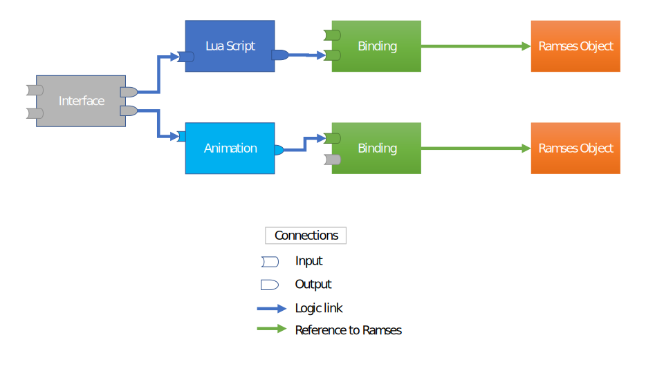

..
    -------------------------------------------------------------------------
    Copyright (C) 2020 BMW AG
    -------------------------------------------------------------------------
    This Source Code Form is subject to the terms of the Mozilla Public
    License, v. 2.0. If a copy of the MPL was not distributed with this
    file, You can obtain one at https://mozilla.org/MPL/2.0/.
    -------------------------------------------------------------------------

.. default-domain:: cpp
.. highlight:: cpp

=========================
Overview
=========================

This page provides an overview of the ``Logic Engine`` C++ API, primary object types, structure and interaction.

.. note::

    Prefer learning by example? Jump straight to the :ref:`examples <List of all examples>`!
    Looking for a specific class or method? Check the :ref:`class index <Class Index>`

--------------------------------------
Object types and their relationships
--------------------------------------

The ``Logic Engine`` consists of a network of logical ``nodes`` with a set of inputs and outputs and
links between them to send data from one node to another.

The following graph shows an example of such network:

There are different types of logic nodes (Interfaces, Lua scripts, Animations, Bindings) which have different
execution logic, but all share the same mechanism to link data between the nodes. Each node has a set of inputs
and outputs which can be linked together to transfer data from one (node output) to another (node input).

The logic nodes have inputs and outputs which let them interact with other entities
(can be other logic nodes, or ramses objects, or application code/data). Logic nodes
can be linked together using directional links, where the output of one node provides its data to
the input of another node (:ref:`more info on links <Creating links between nodes>`).
Logical nodes can't interact with Ramses objects directly. Instead, they
can link to ``Bindings`` which are designed to "bind" ``Ramses`` objects and modify
their properties' values (node visibility, transformation values, material properties... etc.)
(:ref:`more info on bindings <Linking logic nodes to Ramses scene objects>`).

The greyed-out slots in the image above represent input properties which are neither linked nor
have a statically configured value. In bindings, this denotes that the corresponding ``Ramses`` property
is not being updated by the ``Logic Engine`` (see also :ref:`the section on data flow <Data Flow>`). In other nodes, these
properties will receive a default value at runtime (``0``, ``0.0f``, ``""``, ``true`` etc.) unless explicitly set by the application
logic. Bindings' input values are initialized with the values of the bound `Ramses` object, for all bindings except
:class:`ramses::AppearanceBinding`.

Finally, ``Interface nodes`` have no execution logic, only inputs (and implicit outputs which are identical to the inputs).
Interfaces are supposed to be the bridge between application code/data and the Ramses/Logic asset.
Interface input values are supposed to be explicitly set at runtime, or statically linked to other outputs.
Ideally, the logic node network with interfaces should be designed so that once all the interfaces' inputs are set, the
whole underlying network of nodes is fully defined, i.e. all inputs of all nodes are linked.

--------------------------------------
Data flow
--------------------------------------

The cornerstone of the ``Logic Engine`` is the :func:`ramses::LogicEngine::update` method which
"executes" the network of logic nodes and updates the values of the ``Ramses`` scene bound to them. The nodes
are executed based on a topological graph sort, where the traversal direction is given by the link
pairs (A, B) where A is an output and B is an input property in the logic graph
(as shown :ref:`here <Object types and their relationships>`).

The update logic of each node depends on its type. :class:`ramses::LuaScript` nodes execute their ``run()`` function
and modify some or all of their outputs based on the logic defined in ``run()``.
Nodes which derive from :class:`ramses::RamsesBinding` pass the values of their
input properties to the bound Ramses object. :class:`ramses::LuaInterface` nodes
pass the values of their inputs to other nodes connected to the interface's outputs.

Logic nodes are not executed on every :func:`ramses::LogicEngine::update` iteration in order to save performance.
However, it's guaranteed that:

* logic nodes which were just created will be executed on next update
* logic nodes whose inputs received a new value (either from calling :func:`ramses::Property::set` or from a link)
  will be executed on next update
* binding properties which received a value (regardless of their current value or from the value stored in Ramses) will
  overwrite the value in Ramses on next update. This works both for direct :func:`ramses::Property::set` calls and for values
  received over links
* TimerNodes will be executed always, regardless if their inputs were set

Additionally, bindings' properties are applied selectively - e.g. setting the ``scaling`` property of a :class:`ramses::NodeBinding`
will result in a call to ``ramses::Node::setScaling()``, but will not cause setting any other ``ramses::Node`` properties.
This can be useful if you want to have your own logic e.g.
to control the visibility of all ``Ramses`` nodes, and only use a ``Logic Engine`` to control transformation properties. In that case
you should never set the ``visibility`` property of a Binding object, instead set the visibility directly on the bound ``ramses::Node``.

.. warning::

    We strongly discourage setting values to ``Ramses`` objects and to ``Ramses Logic`` bindings in the same update cycle
    for the same property to avoid unexpected behavior. At any given time, use one *or* the other, not both mechanisms to set values!

===================================
Logic node creation
===================================

The entry point to ``RAMSES logic`` is a factory-style class :class:`ramses::LogicEngine` which can
create instances of all other types of objects supported by ``RAMSES Logic``:

* :class:`ramses::LuaScript`
* :class:`ramses::NodeBinding`
* :class:`ramses::AppearanceBinding`
* :class:`ramses::CameraBinding`

See the full list over at the :ref:`class index <Class index>`.

You can create multiple instances of :class:`ramses::LogicEngine`, but each copy owns the objects it
created, and must be used to destroy them, as befits a factory class.

You can create scripts using the :class:`ramses::LogicEngine` class like this:

.. code-block::
    :linenos:
    :emphasize-lines: 5-14,16-17

    #include "ramses/client/logic/LogicEngine.h"

    using namespace ramses::logic;

    std::string source = R"(
        function interface(IN, OUT)
            IN.gear = Type:Int32()
            OUT.speed = Type:Float()
        end

        function run(IN, OUT)
            OUT.speed = IN.gear * 15
        end
    )"

    LogicEngine engine;
    LuaScript* script = engine.createLuaScript(source, "simple script");
    script->getInputs()->getChild("gear")->set<int32_t>(4);

    script->execute();
    float speed = script->getOutputs()->getChild("speed")->get<float>();
    std::cout << "OUT.speed == " << speed;

For details regarding the ``Lua`` syntax and its specifics, check the :ref:`dedicated section on Lua <Basics of Lua>`.

:class:`ramses::LogicNode` (the base class of :class:`ramses::LuaScript`) provides an interface to access the inputs and outputs declared by the ``interface()``
function - see :func:`ramses::LogicNode::getInputs()` and :func:`ramses::LogicNode::getOutputs()`.

You can :ref:`link nodes <Creating links between nodes>` to form a more sophisticated logic execution graph.

You can :ref:`bind to Ramses objects <Linking logic nodes to Ramses scene objects>` to control a 3D ``Ramses`` scene.

==================================================
Object lifecycle
==================================================

All logic objects are managed by the :class:`ramses::LogicEngine` instance which they were created from.
A logic object ``X`` is created by a method ``X* LogicEngine::createX(...)``. The pointer
returned shall not be freed or deleted, instead objects can be destroyed by calling :func:`ramses::LogicEngine::destroy`.
Logic objects are automatically destroyed when their owning :class:`ramses::LogicEngine` instance is destroyed.
The :class:`ramses::LogicEngine` itself is managed by the :class:`ramses::Scene` it was created from following same principle.

.. note::

    This may seem strange for a library which is based on ``C++17``, but there are good reasons
    for this design choice. Smart pointers don't work well together with Windows DLL's, specifically
    when combining different CRTs. In order to provide a stable API on Windows
    we chose to use raw pointers and hide object creation/deletion behind a pimpl/factory pattern.

There are two cases when objects are implicitly created or destroyed by :class:`ramses::LogicEngine`:

* if :class:`ramses::LogicEngine` is destroyed, all its objects are destroyed as well
* :func:`ramses::LogicEngine::loadFromFile` destroys all previously created objects and creates new objects from loaded file

In both the cases above any existing pointers to destroyed objects are invalidated.

==================================================
Creating links between nodes
==================================================

One of the complex problems of 3D graphics development is managing complexity, especially for larger projects.
For that purpose it is useful to split the application logic into multiple logic nodes (usually Lua scripts), so that individual nodes
can remain small and easy to understand. To do that, ``Ramses Logic`` provides a mechanism to link node
properties - either statically or during runtime, in order to pass data from ``1`` producer node to ``N``
consumer nodes.

Here is a simple example how links are created to link two Lua scripts:

.. code-block::
    :linenos:

    LogicEngine logicEngine;
    LuaScript* sourceScript = logicEngine.createLuaScript(R"(
        function interface(IN, OUT)
            OUT.source = Type:String()
        end
        function run(IN, OUT)
            OUT.source = "World!"
        end
    )");

    LuaScript* destinationScript = logicEngine.createLuaScript(R"(
        function interface(IN)
            IN.destination = Type:String()
        end
        function run()
            print("Hello, " .. IN.destination)
        end
    )");

    logicEngine.link(
        *sourceScript->getOutputs()->getChild("source"),
        *destinationScript->getInputs()->getChild("destination"));

    // This will print 'Hello, World!' to the console
    logicEngine.update();

In this simple example, the 'sourceScript' provides string data to the 'destinationScript' every time the  ``LogicEngine::update``
method is called. The 'destinationScript' receives the data in its input property and can process  it further. After
two scripts are linked in this way, the :class:`ramses::LogicEngine` will execute them in a order which ensures data consistency, i.e.
scripts which provide data to other scripts' inputs are executed first. In this example, the 'sourceScript' will be executed before
the 'destionationScript' because it provides data to it over the link.

Creating links as shown above enforces a so-called 'directed acyclic graph', or ``DAG``, to the :class:`ramses::LogicNode` inside a given
:class:`ramses::LogicEngine`. In order to ensure data consistency, this graph can not have cyclic dependencies, thus following operations
will cause an error:

* Creating a link from any :class:`ramses::LogicNode` to itself
* Creating a link from node A to node B if node B is linked to node A (links have a direction and this creates a two-node loop!)
* Any set of :class:`ramses::LogicNode` instances whose links form a (directed) circle, e.g. A->B->C->A (this is caught at update time, not at link creation time)

There is an exception to the 'no cycles' rule if using weak links. These allow data propagation in a cycle which would not be
possible with regular links. Weak links should be used only if absolutely necessary and it is essential to fully understand their caveats
and limitations first before using them. See :func:`ramses::LogicEngine::linkWeak` for details.

A link can be removed in a similar fashion:

.. code-block::
    :linenos:

    logicEngine.unlink(
        *sourceScript->getOutputs()->getChild("source"),
        *destinationScript->getInputs()->getChild("destination"));

For more detailed information on the exact behavior of these methods, refer to the documentation of the :func:`ramses::LogicEngine::link`
and :func:`ramses::LogicEngine::unlink` documentation. The `data flow section <Data Flow>`_ explains in detail how data is passed throughout the
network of logic nodes when connected by links.

==================================================
Linking logic nodes to Ramses scene objects
==================================================

Lua scripts would not make much sense on their own if they can't interact with ``Ramses`` scene objects. The way to
link script output properties to ``Ramses`` scene objects is by creating :class:`ramses::RamsesBinding` instances and linking their inputs to scripts' outputs.
There are different binding types depending on the type of scene object - refer to :class:`ramses::RamsesBinding` for the full list of derived classes.
Bindings can be linked in the exact same way as :ref:`scripts can <Creating links between nodes>`, they derive from the
same base class - :class:`ramses::LogicNode`. The only
difference is that the bindings have only input properties (the outputs are implicitly defined and statically linked to the scene
objects attached to them), whereas scripts have inputs and outputs explicitly defined in the script interface.

One might wonder, why not allow to directly link script outputs to ``Ramses`` objects?
The reason for that is two-fold:

* Separation of concerns between pure script logic and scene updates
* This allows to handle all inputs and outputs in a generic way using the :class:`ramses::LogicNode` class' interface from
  which both :class:`ramses::LuaScript` and :class:`ramses::NodeBinding` derive

The `section on data flow <Data Flow>`_ describes how data is passed throughout the network of logic nodes and when
bound Ramses objects are updated and when not.

.. note::

    Binding input values are initialized with the same values as the scene objects they "bind". The only
    exception to this are Appearance bindings - extracting all data from Ramses Appearances would incur performance
    costs not worth the convenience.

==================================================
Dynamic sorting of content
==================================================

The ``Logic Engine`` provides a mechanism to dynamically sort select ``ramses::MeshNode`` and ``ramses::RenderGroup``
objects. To do so, you can use the :class:`ramses::RenderGroupBinding` class. The class works similarly to
other binding classes - it statically binds to Ramses content (configured using :class:`ramses::RenderGroupBindingElements`)
and allows setting the rendering priority of the bound content by setting input properties of type ``Int32`` with a name as
configured in :class:`ramses::RenderGroupBindingElements`.

=========================
Animations
=========================

Animations are central to any dynamic real-time scene. It is possible to implement simple animations with ``Lua`` scripts
or even write your own ``C++`` wrapper which changes a value over time, linked to a ``Ramses`` object via :class:`ramses::RamsesBinding`.
However, such solution would not scale well for more complex animations with preauthored
splines of keyframes and timestamps. :class:`ramses::AnimationNode` and :class:`ramses::DataArray` are designed to provide a good
compromise between performance and a data-centric design which imports animation data from external sources or formats.

The animation support in ``Ramses Logic`` is provided by the following two classes:

* :class:`ramses::DataArray` - contains the animation data (keyframes and time stamps)
* :class:`ramses::AnimationNode` - provides an interface to control and holds the current state of animations

Consider also using :class`ramses::TimerNode` for easy way to generate and provide timing information to :class:`ramses::AnimationNode`.

-------------------------------
Data Arrays
-------------------------------

:class:`ramses::DataArray` is a simple data container with immutable data. Various data types and interpolation types are supported (see the
class documentation for details). Data arrays by themselves have no meaning, they must be bundled in animation channels (:struct:`ramses::AnimationChannel`).
The contents of an animation channel depends on its type. For example, a simple linear animation only needs two data arrays - one for time stamps and
one for key frames. A complex cubic animation channel also needs tangent arrays. It is possible to reuse the same data array in multiple channels - e.g.
if multiple channels use the same time stamps (often the case for multi-channel animations).

-------------------------------
Animation Nodes
-------------------------------

:class:`ramses::AnimationNode` holds the state of an animation and provides inputs to control it and outputs to check the
output values or to link them to other scripts or directly to instances of :class:`ramses::RamsesBinding`.
To query input and output properties, use the corresponding methods in the base class :class:`ramses::LogicNode`.
Based on how many animation channels were provided when creating the :class:`ramses::AnimationNode`
has an output property of corresponding data type (matching the keyframes data type) for each channel.
The value of these outputs is updated after every :func:`ramses::LogicEngine::update` call and can be directly queried
or it can be linked to any other logic node, e.g. :class:`ramses::RamsesBinding`.

:class:`ramses::AnimationNode` has a simple control interface, the ``progress`` input is a point in [0,1] normalized range,
which tells the animation node logic to which position on the animation timeline to jump to during next update. The local animation
timeline is simply starting from time zero to the last animation timestamp and ``progress`` is the normalized form of that.
This gives the application full control over the way how time is applied to the animation, e.g. changing speed, reverse play, rewind,
pause, restart etc., are all possible either from a control Lua script linked to the ``progress`` or from C++ API.

-------------------------------
Timer Node
-------------------------------

``Ramses logic`` provides a tool that can help with dealing with time in your application, a :class`ramses::TimerNode` can be a central node
which provides timing to all animation related logic. Timer node can operate in two modes, either generate time using system clock or forward
application provided time to the logic network. This allows quick and easy switch between stages of the development, e.g. prototyping, testing
or production, where for some use cases auto-generated time is easier to work and some require well specified timing provided by application.
There can also be multiple timer nodes so different time contexts can be specified if needed.

---------------------------------
Static vs. dynamic animation data
---------------------------------

:class:`ramses::AnimationNode` can be used in two different modes, with static data or dynamic data. By default animation node's animation data
(timestamps, keyframes) cannot be modified after the data is provided when creating an instance of :class:`ramses::AnimationNode`, it is static.
There is however a way to create :class:`ramses::AnimationNode` which allows modifying the animation data at any point in time, even during animating
- enable :func:`ramses::AnimationNodeConfig::setExposingOfChannelDataAsProperties` when creating the :class:`ramses::AnimationNode`.
Animation node created this way will have exact same functionality as the static version but in addition exposes some animation data in form
of node properties, namely timestamps and keyframes from all its channels. The animation data properties can be used as any other logic node properties,
they can be set directly or linked to another node.

.. warning::

    Animation node with exposed data as properties is limited to a fixed maximum number of keyframes
    (see :func:`ramses::AnimationNodeConfig::setExposingOfChannelDataAsProperties` for details) and suffers from a relatively high performance hit
    when animating compared to the default 'static' animation node. The performance hit scales with the number of keyframes,
    keep them as low as possible when using it!

=========================
Error handling
=========================

Some of the ``RAMSES Logic`` classes' methods can issue errors when used incorrectly or when
a ``Lua`` script encounters a compile-time or run-time error. Those errors are collected via the Ramses SDK error handling mechanism
which uses :class:`ramses::RamsesFramework` to register always the last occurred error until it is retrieved by calling
:func:`ramses::RamsesFramework::getLastError()`.
The :struct:`ramses::Issue` contains additional information: human readable message (e.g. stack trace information for Lua runtime errors)
and optionally a pointer to the originating :class:`ramses::RamsesObject` which reported or caused the error (for errors which occured during
:func:`ramses::LogicEngine::update()` and can't be directly attributed to a specific API call).

For code samples which demonstrate how compile-time and runtime errors can be gracefully handled,
have a look at the :ref:`examples <List of all examples>`.

To intercept and fix potential content problems, you can use :func:`ramses::LogicEngine::validate()`. This method will
scan the contents of the ``Logic Engine`` and report pontential issues which are not fatal, but may result in suboptimal
performance, data inconsistency or serialization bugs. It is highly recommended to also validate the scene this ``LogicEngine`` is used with
(:func:`ramses::Scene::validate()`) to prevent issues during runtime.

=====================================
Iterating over object collections
=====================================

Iterating over objects can be useful, for example when the logic was loaded from file
or when applying search or filter algorithms over all objects from a specific type.
The :class:`ramses::LogicEngine` class provides iterator-style access to all of its objects:

.. code-block::
    :linenos:

    LogicEngine logicEngine;
    Collection<LuaScript> allScripts = logicEngine.scripts();

    for(const auto script : allScripts)
    {
        std::cout << "Script name: " << script->getName() << std::endl;
    }

The :class:`ramses::Collection` class and the iterators it returns are STL-compatible, meaning that you can use them with any
other STL algorithms or libraries which adhere to STL principles. The iterators implement ``forward`` iterator semantics
(`have a look at C++ docs <https://en.cppreference.com/w/cpp/named_req/ForwardIterator>`_).

.. note::

    The :class:`ramses::Iterator` and :class:`ramses::Collection` classes are not following the ``pimpl`` pattern as the rest of
    the ``Ramses Logic`` to performance ends. Be careful not to depend on any internals of the classes (mostly the Internally
    wrapped STL containers) to avoid compatibility problems when updating the ``Ramses Logic`` version!

======================================
Security and memory safety
======================================

One of the biggest challenges of modern ``C++`` is finding a balance between compatibility with older compilers
and platforms, while not sacrificing memory safety and code readibility. In the ``RAMSES`` ecosystem we try to
find a good balance by testing with different compilers, employing automation techniques and making use of
modern compiler-based tools to perform static code analysis and introspection. The methods and tools we use are:

* compiling on different compilers (MSVC, gcc, clang) with strict compiler settings
* clang-tidy with fairly strict configuration
* valgrind
* treat warnings as errors
* use various clang-based sanitizers (undefined behavior, thread sanitizer, address sanitizer)

Those tools cover a lot of the standard sources of problems with ``C++`` revolving around memory. We also uphold
a strict code review, ensuring that each line of code is looked at by at least two pairs of eyes, for critical
parts of the code usually more than that. Still, no project is safe from bugs, thus we recommend following
some or all of the additional conventions and best practices from below subchapters to minimize the risk of
memory-related bugs and malicious attacks when using ``Ramses Logic``.

-----------------------------------------------------
Additional memory safety measures
-----------------------------------------------------

One of the biggest sources of bugs and security problems in ``C++`` arise from memory management, both in terms of
allocation/deallocation and memory access and boundary checks. ``Ramses Logic`` takes care of memory lifecycle
for all objects created by it, and provides raw pointer access to their memory. We suggest creating your own wrapper
objects for anything created or loaded by the :class:`ramses::LogicEngine` class and ensure it is destroyed exactly once
and only after not used any more.

Furthermore, pay special attention when passing strings as ``std::string_view`` to and from the ``Logic Engine`` as those
may not be terminated by a 0 and may lead to out of bounds accesses when used by functions expecting 0-termination.

-----------------------------------------------------
Additional security considerations
-----------------------------------------------------

``Lua`` is a script language, and as such provides great flexibility and expresiveness at the cost of
more error potential and security risks compared to other techniques for describing logic. The ``Logic engine`` and the
underlying ``sol`` library do a lot of error checking and prevents undefined behavior by executing faulty script code,
but there are cases which can't be checked.

To give one example, a script may overwrite the global variables ``IN`` or ``OUT``
from within script code because of the nature of ``Lua`` scripts. This can't be automatically checked by the runtime without
overloading the global ``Lua`` metatable and injecting every single assignment operation, which is too high a cost to avoid
faulty scripts.

To avoid malicious or broken script, we suggest implementing an additional security mechanism on top
of ``Ramses Logic`` which doesn't allow execution of scripts of unknown origin. Also, build your code with errors in mind
and force scripts into an automated testing process. We also advise to use hashsums and whitelisting techniques to only
execute scripts which are tested and verified to be benign.

.. TODO add more docs how environment work, what is the level of isolation between different scripts etc.

-----------------------------------------------------
Sanitizing of files and buffers
-----------------------------------------------------

Since the ``Logic Engine`` can deserialize itself from files and memory buffers, it opens possibilities for data corruption and
truncation. To mitigate those risks, we use Flatbuffer's "Verify" feature which checks the integrity of data,
detects possible index-out-of-range issues and prevents binary data abuse. What it *doesn't* check is
whether the actual memory buffer size (passed in :func:`ramses::LogicEngine::loadFromBuffer`) is consistent with the size provided
by the user. The application must ensure that this size does not exceed the size of the actual memory!

=========================
Performance
=========================

------------------------------
Profiling logic update cycles
------------------------------

The SDK provides means to do basic measuring of logic network update times. See :class:`ramses::LogicEngineReport`
which gives several useful statistics, e.g. which nodes where executed and how long it took for each of them.
We suggest to collect this data over several update cycles in some worst case scenario (performance-wise)
and investigate which nodes take the most time to update. Also for normal use cases consider taking a look at
how many nodes were needed to be updated and if the topology could be improved so that this amount is reduced
to only the necessary nodes.

.. note::
    An easy way to quickly get insight what happens inside a logic network is to use the :ref:`GUI viewer <ramses-logic-viewer>`.
    The viewer displays the stats reported by the :class:`ramses::LogicEngineReport` dynamically or statically over multiple
    update cycles.

.. note::
    Another easy way to quickly get insight what happens inside a logic network is to look at the ``periodically logged node update statistics``
    in the Ramses Shell. These are calculated over the last ``N`` updates which is adjustable.
    Included are e.g. ``update execution time in microseconds`` or ``count of nodes executed in percentage of total`` (both Average, Min and Max).

-------------------------
Optimizing Lua code
-------------------------

Lua is one of the fastest interpreted languages, especially when used efficiently. One of the best reading
we could recommend is the `second chapter <https://www.lua.org/gems/sample.pdf>`_ of the ``Lua programming gems`` by Roberto Ierusalimschy.
It's short, and provides a very hands-on overview of what to do and what not to do when processing data with Lua.

The ``Logic Engine`` extends plain lua with a way to interact with Ramses and with other scripts and modules. This is mostly
done by providing so-called `userdata` types and objects - those work like Lua tables, but have C++ implementation behind them.
Working with these generally costs more than working with plain Lua, since Lua knows how to optimize table accesses better than
usertypes. Try to minimize the access to `userdata` such as ``IN``, ``OUT`` and modules as much as possible. The :ref:`benchmarks <Benchmarks>`
provide more info on the difference between standard Lua and the Logic Engine dialect.

-------------------------
Benchmarks
-------------------------

In order to be able to track and improve
the runtime of the ``Logic Engine``, we maintain a set of benchmarks based on the google-benchmark library.
These benchmarks can be used to measure the time it takes for specific operations under different loads.
We kindly ask our users and developers to report performance problems by creating a benchmark which describes
the specific use-case which needs optimizing. Refer to the
`google-benchmark docs <https://github.com/google/benchmark>`_ for hints how to
design good benchmarks, to set the time measurement units, derive O-complexity, etc.

-------------------------
Optimizing file size
-------------------------

It's possible to reduce the file size of the exported LogicEngine data by storing the bytecode of the
Lua scripts and modules, instead of the source code. This might sound very attractive, but it has two
major caveats:

* Lua bytecode is notoriously vulnerable to malicious attacks
* Bytecode is architecture-specific, i.e. you can't run ARM bytecode on a x86 processor

In order to provide a good mix between flexibility and performance, the LogicEngine allows choosing what
to be stored when saving into a binary file: only the source code, only the bytecode, or both. While the first
option is the safest and most robust, it is also the slowest. Storing both source and binary will offer both fast loading
when the architecture matches and a fallback solution when it doesn't, but it results in larger binary files. Choose
an option which suits the needs of your application. Read more in :func:`ramses::SaveFileConfig::setLuaSavingMode`.

===========================
List of all logic examples
===========================

.. toctree::
    :maxdepth: 1
    :caption: Examples

    examples/logic/00_minimal
    examples/logic/01a_primitive_properties
    examples/logic/01b_struct_properties
    examples/logic/01c_array_properties
    examples/logic/02_errors_compile_time
    examples/logic/03_errors_runtime
    examples/logic/04_ramses_scene
    examples/logic/05_serialization
    examples/logic/07_links
    examples/logic/08a_static_animation
    examples/logic/08b_dynamic_animation
    examples/logic/09_modules
    examples/logic/10_globals
    examples/logic/11_interfaces
    examples/logic/12_anchor_point
    examples/logic/13_render_order
    examples/logic/14_skinbinding
    examples/logic/15_meshnodebinding
